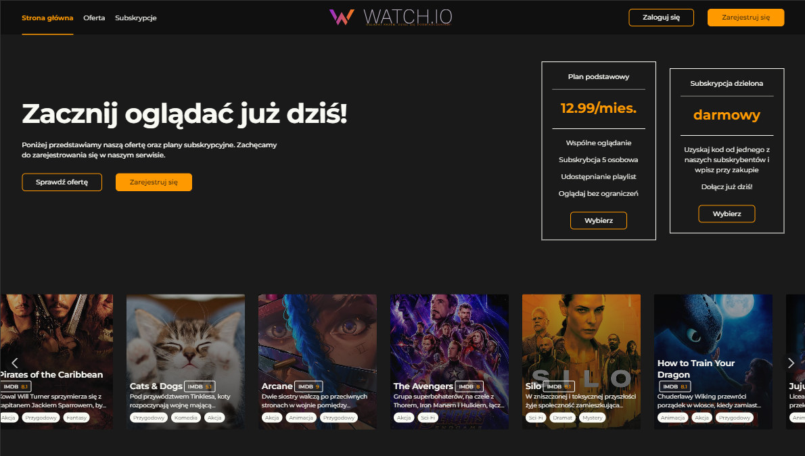
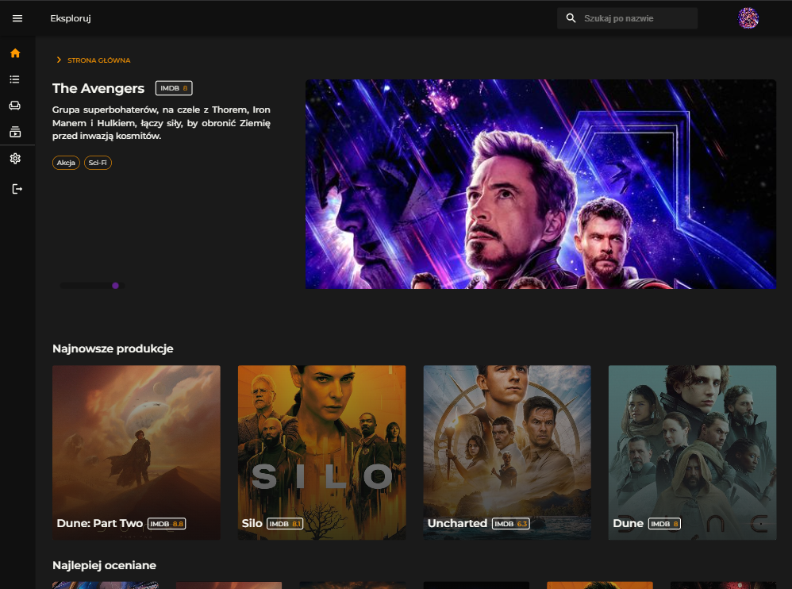

<div style="display: flex; justify-content: center; align-items: center;">
    
</div>


# WatchIo

A streaming application with social elements, which was the subject of an engineering thesis during university studies in IT.


## Authors

- **[@radkam2000](https://www.github.com/radkam2000)** - database, backend & containerization
- **[@nataliaprazmo](https://github.com/nataliaprazmo)** - design & frontend

---

## Technologies

#### Design & Frontend
    

#### Database & Backend
  

#### Other tools used
  

---

## Features

- streaming
- shared watchlists
- shared subscription for up to 5 people
- synchronized watching together in rooms
- user account:
    watching & exploring series, add series to watchlist, data changes
- admin account:
    managing series

## Objectives

- simplified playlists & subscriptions sharing between users
- building community & facilitating contact between users
- home cinema effect with friends
- easier & synchronized watching with others despite the distance between

## Problems Solved

- **Problem:**  need to look for ways to share content on other platforms\
    **Resolution:** shared watchlists
- **Problem:** difficulties to create subaccounts within one subscription\
    **Resolution:** shared subscriptions
- **Problem:** social isolation, especially in the pandemic context \
    **Resolution:** web page for synchronized watching with others

---

## Getting started

To get started with this project, you have to run the entire application using Docker. You also need API key from [Stripe](https://dashboard.stripe.com/test/apikeys) to have subscriptions and external payments system and API key from [OMDb](https://www.omdbapi.com/apikey.aspx) for series data retrieval.

#### Optaining Stripe API key
1. Get Your key from [Stripe](https://dashboard.stripe.com/test/apikeys)
2. Go to backend/.env file and replace api_key for STRIPE_SECRET_KEY and STRIPE_PUBLISHABLE_KEY with Your key

#### Optaining OMDb API key
1. Get Your key from [OMDb](https://www.omdbapi.com/apikey.aspx)
2. Go to backend/.env file and replace api_key for OMDB_API_KEY with Your key

#### Running the Entire Application with Docker

1. Ensure you have Docker and Docker Compose installed on your machine. If you haven't installed them yet, you can download Docker from Docker's official website and Docker Compose from Docker's Compose documentation.
2. Navigate to the root directory of your project where the docker-compose.yml file is located.
3. Run the following command to build and start the application:

```bash
docker compose up
```

This command will build the Docker images for your frontend and backend services and start the containers with MongoDB. The frontend will be accessible at [http://localhost:3000](http://localhost:3000)


#### Prerequisites
- Docker and Docker Compose must be installed on your machine.
- You need API key from [Stripe](https://dashboard.stripe.com/test/apikeys) and [OMDb](https://www.omdbapi.com/apikey.aspx)

#### Conclusion

By following these steps, you should be able to run the entire application using Docker. This setup allowed for a flexible development environment, making it easier to work on individual components of the application.

---

## Acknowledgements & API

- [OMDb API](https://www.omdbapi.com/) - for films data
- [Stripe](https://stripe.com/en-pl) - subscriptions and external payments handling
- [Docker](https://www.docker.com/) - containerization
- [Material UI](https://mui.com/) - components & icons

---

<div style="display: flex; flex-direction: column; gap: 16px; justify-content: center; align-items: center;">
    
    
</div>

